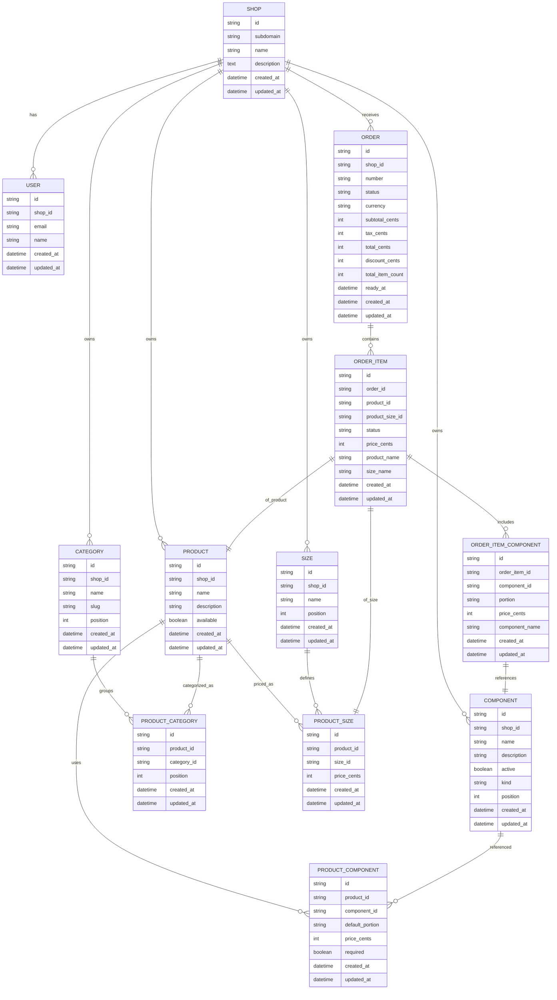

# Application Architecture Design

## Executive Summary
- **Goal**: build a multi-tenant ordering + preparation system where every shop manages its own catalog, receives orders, and tracks them in real time.
- **Tenancy**: every record other than `SHOP` is scoped by `shop_id`; application middleware resolves the current shop via subdomain.
- **Pricing**: all monetary values are stored as integer cents with default `0` to avoid null arithmetic; snapshot pricing is persisted on order artifacts.
- **Customization model**: portion-based components with one `ORDER_ITEM_COMPONENT` per portion selection—never store quantities or aggregated totals.
- **Order duplication rule**: duplicate products in a cart become individual `ORDER_ITEM` rows so each can diverge in customizations.

> Use this summary as the quick reference when aligning other teams or writing tickets.

## Build Roadmap (Suggested Order)
1. **Tenant resolution + scaffolding**
   - Implement subdomain middleware that loads `current_shop`.
   - Add `shop_id` constraints + indexes on all tenant tables.
2. **Catalog domain**
   - CRUD for `PRODUCT`, `SIZE`, `COMPONENT`, `CATEGORY`, and join tables.
   - Seed defaults per shop and validate `default_portion` + monetary defaults.
3. **Ordering workflow**
   - Create order creation service that snapshots catalog data onto `ORDER`, `ORDER_ITEM`, `ORDER_ITEM_COMPONENT`.
   - Enforce status enums and event hooks that update `ORDER.total_item_count` and monetary fields.
4. **Preparation + real-time layer**
   - Broadcast `ORDER_ITEM` status transitions (ActionCable/AnyCable preferred) and derive `ORDER.status` based on aggregation rules.
5. **Operational visibility**
   - Build preparation dashboard grouped by status lanes, status history, and ready/completed timestamps.

Treat each milestone as shippable: catalog must be stable before order creation logic; order creation must be deterministic before event streaming.

## Overview
- Multi-tenant domain models for catalog, ordering, and real-time preparation tracking.
- Each shop operates independently with its own catalog and orders.
- Pricing uses integer `price_cents` with defaults of 0 across catalog and order artifacts.
- Portion-based component selection per order item; one row per portion, no quantities or stored line totals.
- Multiple instances of the same product create separate `ORDER_ITEM` rows (e.g., 2x same product = 2 rows).

### Quick Entity Cheat Sheet
| Domain | Key tables | Notes |
| --- | --- | --- |
| Tenancy | `SHOP`, `USER` | `SHOP.subdomain` unique, `USER` scoped via `shop_id`. |
| Catalog | `PRODUCT`, `SIZE`, `COMPONENT`, `CATEGORY`, join tables | All include `shop_id`; `PRODUCT_COMPONENT.default_portion` drives included amount. |
| Ordering | `ORDER`, `ORDER_ITEM`, `ORDER_ITEM_COMPONENT` | Snapshot names + pricing, all money defaults to 0. |
| Real-time | Status enums + broadcasts | UI listens to `ORDER_ITEM.status`, aggregates into `ORDER`. |

## Architecture Overview
- Multi-tenancy: `SHOP` (subdomain-based routing), all catalog and order tables scoped by `shop_id`.
- Users: `USER` (basic info, no roles yet; users can access all views: order form, preparation view, status view).
- Catalog: `PRODUCT`, `SIZE`, `COMPONENT`, `PRODUCT_SIZE`, `PRODUCT_COMPONENT`, `CATEGORY`, `PRODUCT_CATEGORY`.
- Ordering: `ORDER`, `ORDER_ITEM`, `ORDER_ITEM_COMPONENT` with snapshot pricing and denormalized names.
- Status flow:
  - Order: `pending → accepted → in_progress → ready → completed` (or `canceled`).
  - Order item: `queued → preparing → ready → delivered` (or `canceled`).
- Real-time: UI subscribes to `ORDER_ITEM.status` changes; aggregate to update `ORDER.status`.
- Persistence: snapshot prices on order rows; avoid live catalog joins for history.
- Defaults: all monetary fields default to 0; catalog defines `default_portion` for included components.
- Timestamps: all tables include `created_at` and `updated_at` for auditability.

## ER Diagram

> **Note**: This diagram represents the complete data model with all relationships, foreign keys, and field types. It accurately reflects the multi-tenant architecture, snapshot pricing strategy, and denormalized order artifacts. All relationships are properly defined with cardinality (one-to-many, many-to-many). The diagram serves as the authoritative reference for database schema design and migration planning.

### Mermaid Version



### DBML Version (Recommended for ER Diagrams)

DBML (Database Markup Language) is specifically designed for database ER diagrams and provides better visualization, export options, and tooling support.

```dbml
Table shops {
  id string [pk]
  subdomain string [unique]
  name string
  description text
  created_at datetime
  updated_at datetime
}

Table users {
  id string [pk]
  shop_id string [ref: > shops.id]
  email string
  name string
  created_at datetime
  updated_at datetime
}

Table categories {
  id string [pk]
  shop_id string [ref: > shops.id]
  name string
  slug string
  position int
  created_at datetime
  updated_at datetime
}

Table products {
  id string [pk]
  shop_id string [ref: > shops.id]
  name string
  description string
  available boolean
  created_at datetime
  updated_at datetime
}

Table product_categories {
  id string [pk]
  product_id string [ref: > products.id]
  category_id string [ref: > categories.id]
  position int
  created_at datetime
  updated_at datetime
}

Table sizes {
  id string [pk]
  shop_id string [ref: > shops.id]
  name string
  position int
  created_at datetime
  updated_at datetime
}

Table product_sizes {
  id string [pk]
  product_id string [ref: > products.id]
  size_id string [ref: > sizes.id]
  price_cents int [default: 0]
  created_at datetime
  updated_at datetime
}

Table components {
  id string [pk]
  shop_id string [ref: > shops.id]
  name string
  description string
  active boolean
  kind string
  position int
  created_at datetime
  updated_at datetime
}

Table product_components {
  id string [pk]
  product_id string [ref: > products.id]
  component_id string [ref: > components.id]
  default_portion string
  price_cents int [default: 0]
  required boolean
  created_at datetime
  updated_at datetime
}

Table orders {
  id string [pk]
  shop_id string [ref: > shops.id]
  number string
  status string
  currency string
  subtotal_cents int [default: 0]
  tax_cents int [default: 0]
  total_cents int [default: 0]
  discount_cents int [default: 0]
  total_item_count int [default: 0]
  ready_at datetime
  created_at datetime
  updated_at datetime

  Indexes {
    (shop_id, number) [unique]
  }
}

Table order_items {
  id string [pk]
  order_id string [ref: > orders.id]
  product_id string [ref: > products.id]
  product_size_id string [ref: > product_sizes.id]
  status string
  price_cents int [default: 0]
  product_name string
  size_name string
  created_at datetime
  updated_at datetime
}

Table order_item_components {
  id string [pk]
  order_item_id string [ref: > order_items.id]
  component_id string [ref: > components.id]
  portion string
  price_cents int [default: 0]
  component_name string
  created_at datetime
  updated_at datetime
}
```

### How to View the Diagrams

**Mermaid:**
- **Mermaid Live**: Open `https://mermaid.live`, paste the code block, and render.
- **GitHub**: GitHub natively renders Mermaid in Markdown files.
- **VS Code**: Install the "Markdown Preview Mermaid Support" extension.
- **draw.io**: Insert → Advanced → Mermaid, then paste the block.

**DBML (Recommended):**
- **dbdiagram.io**: Open `https://dbdiagram.io`, paste the DBML code block, and render. Provides beautiful visualizations, export to SQL/PDF/PNG, and interactive exploration.
- **VS Code**: Install the "DBML Preview" extension for inline rendering.
- **GitHub**: Use the dbml-cli tool or dbdiagram.io's export feature to generate images.
- **Benefits**: Better ER diagram visualization, automatic layout, export capabilities, and purpose-built for database schemas.

## Multi-Tenancy

* All catalog and order tables include `shop_id` foreign key to `SHOP`.
* Tenant isolation: all queries must be scoped by `shop_id` (application-level scoping via `default_scope` or database-level RLS).
* Subdomain routing: middleware extracts shop from subdomain and sets `current_shop` context.
* Each shop operates independently with its own catalog, orders, and users.

### Tenant-Scoped Entities
* **Shop-specific**: `PRODUCT`, `COMPONENT`, `CATEGORY`, `SIZE`, `ORDER`, `ORDER_ITEM`, `ORDER_ITEM_COMPONENT`, `USER`.
* **Global consideration**: `SIZE` could be global (Small/Medium/Large) but currently scoped per shop for flexibility.

### Indexing Strategy
* All foreign key indexes should include `shop_id` as the first column for efficient tenant-scoped queries.
* Composite indexes: `(shop_id, order_id)`, `(shop_id, product_id)`, `(shop_id, status)`, etc.

## Users

* `USER` entity stores basic user information (email, name).
* No roles/permissions yet; all users can access all views:
  * Order form (create orders)
  * Preparation view (kitchen/staff view)
  * Status view (customer order tracking)
* Users are scoped to a shop (`shop_id`).
* Future: roles/permissions can be added without schema changes.

## Relationships

* `SHOP` contains `USER`, `PRODUCT`, `COMPONENT`, `CATEGORY`, `SIZE`, and `ORDER` rows.

* `ORDER` contains `ORDER_ITEM` rows; each item represents a chosen product and size.

* **Multiple same products**: If a customer orders 2x of the same product, create 2 separate `ORDER_ITEM` rows. This allows each item to have different component customizations (e.g., one with all components, another with extra toppings).

* `ORDER_ITEM` references `PRODUCT_SIZE` (snapshot of base price for the chosen size).

* Per-item components are represented by `ORDER_ITEM_COMPONENT` rows; each row captures one portion/selection of a component.

## Snapshot Pricing & Denormalization

* `ORDER_ITEM.price_cents` copies `PRODUCT_SIZE.price_cents` at purchase time.

* Each `ORDER_ITEM_COMPONENT.price_cents` is a snapshot of the per-portion price at purchase (default `0` for included portions; positive for paid extras or upgraded portions).

* Store prices directly on order artifacts to preserve history across catalog price changes.

### Denormalized Names on Order Rows

* **Why**: If catalog items are renamed or deleted, historical orders should still display readable names without joining to catalog tables.

* **Implementation**:
  * `ORDER_ITEM.product_name`: snapshot of `PRODUCT.name` at order time.
  * `ORDER_ITEM.size_name`: snapshot of `SIZE.name` at order time.
  * `ORDER_ITEM_COMPONENT.component_name`: snapshot of `COMPONENT.name` at order time.

* **Example**: If a product "Strawberry Waffle" is renamed to "Berry Waffle Delight", old orders still show "Strawberry Waffle" in order history.

* **Trade-off**: Slightly more storage, but enables readable order history without catalog joins and protects against catalog deletions.

## Portions Instead of Quantities

* Model one `ORDER_ITEM_COMPONENT` per portion/selection, even for duplicates (e.g., two extra syrups = two rows).

* Use a `portion` field on `ORDER_ITEM_COMPONENT` to represent how much of a component is included per row.

* Allowed values: `none`, `quarter`, `half`, `three_quarters`, `full`.

  * Included components default to `full` and `price_cents = 0`.

  * If a customer chooses `half`, `quarter`, `three_quarters`, or `none`, set `portion` accordingly and keep `price_cents = 0` unless you price upgrades.

  * Extras are additional rows with `portion` typically `full` (or a fractional value) and positive `price_cents` per row.

* This avoids a `quantity` column and keeps each selection explicit and auditable.

### Multiple Same Products

* **No quantity field on ORDER_ITEM**: If a customer orders 2x of the same product, create 2 separate `ORDER_ITEM` rows.

* **Why**: Each item can have different component customizations. Example:
  * Order Item 1: Large Coffee with 2x sugar, no cream
  * Order Item 2: Large Coffee with cream, no sugar

* **Implementation**: When adding items to cart/order, create a new `ORDER_ITEM` row for each instance, even if product/size are identical.

### Included vs Extras

* Included catalog components are represented by one row with `portion` set to the catalog-defined default (e.g., `quarter`, `half`, `three_quarters`, `full`) and `price_cents = 0`.

* Customer adjustments to included components are captured by changing `portion` to `quarter`, `half`, `three_quarters`, or `none`; `price_cents` remains `0` unless you charge for upgrades.

* Paid extras are additional rows (one per portion), typically `portion = full` (or a fractional value) with positive `price_cents` per row; duplicates are modeled by multiple rows.

### Example: Strawberry Waffle

* Default: add `ORDER_ITEM_COMPONENT` for strawberry with `portion = half` (if the catalog default is half), `price_cents = 0`.

* Customer chooses half: set `portion = half`, `price_cents = 0`.

* Customer chooses none: set `portion = none`, `price_cents = 0`.

* Customer adds extra strawberry: add a new component row with `portion = full` and `price_cents` copied from the extra price at purchase; two extras → two rows.

## Totals

* Item total is computed as: `ORDER_ITEM.price_cents + sum(ORDER_ITEM_COMPONENT.price_cents)`.
* Order subtotal is the sum of item totals.
* Final total: `total_cents = subtotal_cents + tax_cents - discount_cents`.

### No Stored Line Totals

* Do not store line totals on items or components; always derive totals by summing `price_cents`.
* This aligns with the per-row portion model and avoids redundant fields.

### Component Pricing Rules

* Included rows generally have `price_cents = 0` and contribute nothing to totals.
* Rows with `price_cents > 0` (paid extras or charged upgrades) are included in the item total.

### Example Totals

* Base price: `ORDER_ITEM.price_cents = 500` (e.g., $5.00).
* Components:
  * Included strawberry: `portion = half`, `price_cents = 0`.
  * Extra chocolate: `portion = full`, `price_cents = 100`.
  * Extra nuts: `portion = quarter`, `price_cents = 50`.
* Item total: `500 + (0 + 100 + 50) = 650` cents ($6.50).

## Defaults and Zero Pricing

* Set `price_cents` default to `0` in migrations for `PRODUCT_SIZE`, `PRODUCT_COMPONENT`, `ORDER_ITEM`, and `ORDER_ITEM_COMPONENT`.

* Included components: `price_cents = 0`; paid additions use positive `price_cents` per row.

* Catalog can enforce `required` on `PRODUCT_COMPONENT` to prevent setting `portion = none` for non-removable items.

### Order Field Defaults
* Set order monetary fields to default `0` in migrations:
  * `ORDER.subtotal_cents`, `ORDER.tax_cents`, `ORDER.total_cents`, `ORDER.discount_cents`.
* Set `ORDER.total_item_count` default to `0`.
* Ensures safe arithmetic and avoids null handling in total computations.

### Order Number and Timestamps
* `ORDER.number`: Unique identifier per shop (e.g., "ORD-001", "ORD-002"). Generated sequentially per shop.
* `ORDER.ready_at`: Timestamp when order status transitions to `ready` (NULL until ready).
* All tables include `created_at` and `updated_at` timestamps for auditability and sorting.

## Data Modeling Details

* Keep `ORDER_ITEM.product_size_id` as the authoritative link for base pricing; store `ORDER_ITEM.product_id` for reporting.

* Denormalized snapshots are implemented: `ORDER_ITEM.product_name`, `ORDER_ITEM.size_name`, `ORDER_ITEM_COMPONENT.component_name` store names at order time.

* Optionally store `product_component_id` on `ORDER_ITEM_COMPONENT` for provenance (links back to `PRODUCT_COMPONENT` that defined the component for this product).

### Timestamps

* All tables include `created_at` and `updated_at` timestamps:
  * `created_at`: When the record was created (immutable).
  * `updated_at`: When the record was last modified (auto-updated on save).
* Use for: sorting orders by date, audit trails, analytics, displaying "ordered X minutes ago".

### Enum Recommendation

* Model `portion` as an enum-backed integer to whitelist valid values and avoid floats:

  * `portion: { none: 0, quarter: 1, half: 2, three_quarters: 3, full: 4 }`.

* Provides readable scopes and stable storage; UI can map to 0, 25, 50, 75, 100%.

### Catalog Defaults
* Store a catalog default portion per product-component (e.g., `default_portion` on `PRODUCT_COMPONENT`) using the same enum values.
* Use this to initialize order items; customers can adjust per item to `none`, `quarter`, `half`, `three_quarters`, or `full`.

## Integrity and Auditing

* Avoid live catalog joins for historical orders; rely on snapshot fields (denormalized names).

* Index foreign keys with `shop_id` as first column: `(shop_id, order_id)`, `(shop_id, product_id)`, `(shop_id, product_size_id)`, `(shop_id, order_item_id)`, `(shop_id, component_id)`.

* Use integer cents across all monetary fields to prevent floating-point issues.

### Database Constraints

* **Price constraints**: All `price_cents` fields must have `CHECK (price_cents >= 0)` constraint.
  * Applies to: `PRODUCT_SIZE.price_cents`, `PRODUCT_COMPONENT.price_cents`, `ORDER_ITEM.price_cents`, `ORDER_ITEM_COMPONENT.price_cents`, `ORDER.subtotal_cents`, `ORDER.tax_cents`, `ORDER.total_cents`, `ORDER.discount_cents`.

* **Portion constraint**: `ORDER_ITEM_COMPONENT.portion` must be one of: `none`, `quarter`, `half`, `three_quarters`, `full` (enforced via enum or CHECK constraint).

* **Status constraints**: `ORDER.status` and `ORDER_ITEM.status` should be validated via enum or CHECK constraint.

* **Foreign key constraints**: All foreign keys should have `ON DELETE RESTRICT` to prevent accidental deletions of referenced records.

* **Unique constraints**:
  * `SHOP.subdomain` must be unique (case-insensitive).
  * `ORDER.number` must be unique within a shop (`(shop_id, number)`).
  * Consider uniqueness on `(order_item_id, component_id)` if one component per item is desired (needs business rule clarification).
## Statuses

### Order Status
- `pending`: order created, awaiting acceptance or payment.
- `accepted`: validated and queued for preparation.
- `in_progress`: one or more items are being prepared.
- `ready`: all items prepared, awaiting pickup/delivery.
- `completed`: delivered to customer.
- `canceled`: canceled by customer or staff.

### Order Item Status
- `queued`: item is waiting to be started.
- `preparing`: currently being built.
- `ready`: finished and awaiting handoff.
- `delivered`: handed off to customer.
- `canceled`: item canceled.

### Real-time View
- Drive the UI from `ORDER_ITEM.status` changes; aggregate item statuses to update `ORDER.status` (e.g., when all items are `ready`, set order to `ready` and populate `ORDER.ready_at`).
- Update `ORDER.total_item_count` when items are added/removed.
- Show per-item progress lanes: `queued → preparing → ready → delivered`.
- Use timestamps/events for analytics if needed; statuses remain the primary state machine.

### Order Status Aggregation Rules
- `pending`: Initial state when order is created.
- `accepted`: Order validated and queued (all items start as `queued`).
- `in_progress`: At least one item is `preparing` or `ready`.
- `ready`: All items are `ready` or `delivered` (set `ORDER.ready_at` timestamp).
- `completed`: All items are `delivered`.
- `canceled`: Order or all items canceled.
